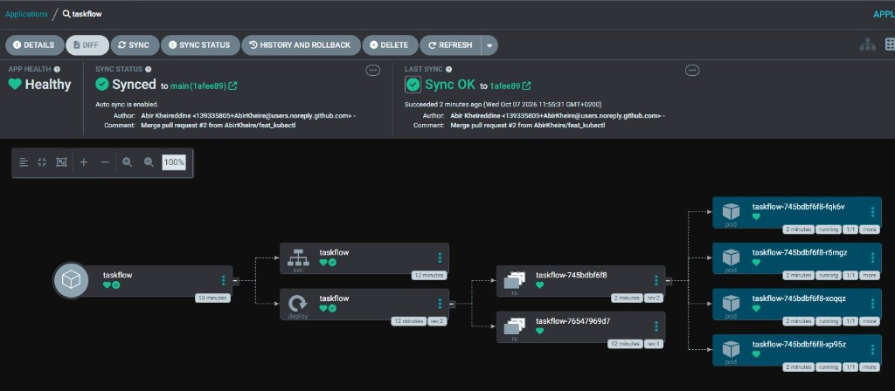

# taskflow-gitops — dépôt GitOps du cours CI/CD M2

Ce dépôt décrit **l'état voulu** de l'application TaskFlow dans Kubernetes.
Argo CD le surveille et aligne le cluster dessus : pour changer la production,
on ne tape pas de commande, on fait une **Pull Request**.

## Installation (à faire chez vous, avant le cours)

Prérequis : Docker Desktop démarré, 8 Go de RAM, 10 Go de disque libre.
Sous Windows : WSL2 (Ubuntu) + intégration WSL de Docker Desktop, et toutes les commandes dans WSL.

```bash
git clone https://github.com/9m7fjfpv9k-cyber/taskflow-gitops.git
cd taskflow-gitops
./scripts/install.sh
```

Le script crée un cluster local `kind`, installe Argo CD et Argo Rollouts,
puis télécharge les images des labs. Comptez 5 à 15 minutes.
Il peut être relancé sans risque.

## Structure

| Chemin                    | Rôle                                                 |
| ------------------------- | ---------------------------------------------------- |
| `apps/taskflow/`          | Les manifests surveillés par Argo CD                 |
| `argocd/application.yaml` | Déclare l'application dans Argo CD                   |
| `exemples/bluegreen/`     | Manifests pour le déploiement Blue-Green             |
| `exemples/canary/`        | Manifests pour le déploiement Canary                 |
| `scripts/install.sh`      | Installation de l'environnement                      |
| `scripts/argocd-ui.sh`    | Ouvre l'interface d'Argo CD                          |
| `scripts/observe.sh`      | Montre quelle version répond, et avec quel code HTTP |

## Images disponibles

`ghcr.io/9m7fjfpv9k-cyber/taskflow` en versions `1.0.0`, `1.1.0`, `2.0.0` et `2.1.0`.

## Équipe

<!-- Fatoumata Naen Bah  & Abir K -->

4 - Lors du changement de version le déploiement sur Argocd a pris 45 secondes
C'est un toujours un pull, parce que Argocd recupère la version sur la branche main du repo "AbirKheire/taskflow-gitops"
La version de l'image est passée de 1.0.0 sur 2.0.0
Le git revert dans le cas de cette PR fermée permet de revenir à la version 1.0.0

5- Argo CD vérifie la branch main et voit que ce n'est pas les même version et va les annuler tout seul et revenir à 4 réplicas de l’image 2.0.0, parce qu'on l'a fait à la main.

6- Pour le revert le déploiement à fait 38 secondes, c'était un pull. Du coup la correction était: version 2.0.0 à 1.0.0 et le deploiement revient a la version 1.0.0

7-



# TaskFlow - observations du lab

1.0.0 -> Blue-Green -> 1.1.0 -> Canary -> 2.0.0

## A. Blue-Green

Après la PR blue-green, ArgoCD est Healthy et Synced. On a un Rollout à la place du Deployment, et deux services : taskflow et taskflow-preview. 4 pods en 1.0.0.

2 Après la PR en 1.1.0, un deuxième ReplicaSet apparait avec 4 pods. Les 4 anciens restent là, donc on a 8 pods en tout. Le rollout est en Paused, il attend le promote.
Du coup il faut taper cette commande pour le promote: kubectl argo rollouts promote taskflow -n taskflow

observe.sh avant promote :

- taskflow : image dans apps. Observartion on est à la vesion actuelle
- taskflow-preview : image dans apps. Observartion on est à la vesion suivante (attendu)
  /scripts/observe.sh
  40 version=1.0.0 http=200

observe.sh après promote : image dans apps
./scripts/observe.sh taskflow-preview
40 version=1.1.0 http=200

Ce qu'on retient : la nouvelle version tourne à côté sans recevoir de trafic, on peut la tester sur preview, et le promote bascule tout d'un coup.

## B. Canary

PR en 2.0.0, le rollout se met en pause à l'étape 1/6 avec un pods de 25.

- stable 1.1.0 : 3 pods
- canary 2.0.0 : 1 pod
- total : 4 pods, pas 8 comme en blue-green

observe.sh :
./scripts/observe.sh
33 version=1.1.0 http=200
7 version=2.0.0 http=200

```
33 version=1.1.0 http=200
 7 version=2.0.0 http=200
```

7 requêtes sur 40 vont sur la 2.0.0, soit environ 17 %. C'est un peu moins que 25 % mais sur 40 requêtes c'est normal, la répartition se fait juste par le nombre de pods (1 sur 4). Que des 200, pas d'erreur.

reponse 4: ./scripts/observe.sh taskflow
32 version=2.0.0 http=200
5 version=2.1.0 http=200
3 version=aucune http=500
Promote jusqu'à 100 % : image dans apps

PR en 2.1.0, codes HTTP : image dans apps
le déploiement se fait progressivement parce on fait des pauses de 60s et après il faut taper la commande pour faire le full promote

Abort et après : image dans apps
Après le "Abort" on a l'état de Argocd en Degraded parce que on a arbort à la main via la commande "kubectl argo rollouts abort taskflow -n taskflow". Sachant Argocd pull les informations de git de la branche main et la version sur git reste sur la 2.1.0 par la PR qu'on avait ouverte, d'où le degraded dans Argocd

## Blue-Green ou Canary pour TaskFlow ?

On choisit Canary.

Risque : en canary, si la version est cassée, seulement une partie des utilisateurs la voit et on peut abort. En blue-green, tout le monde passe sur la nouvelle version d'un coup, donc si on a mal testé sur preview, tout le monde est touché.

Coût : blue-green demande le double de pods pendant le déploiement (8 au lieu de 4). Canary reste à 4.

Le défaut du canary : c'est plus long, et les deux versions tournent en même temps pour de vrais utilisateurs. Si elles ne sont pas compatibles entre elles, blue-green est plus adapté.
